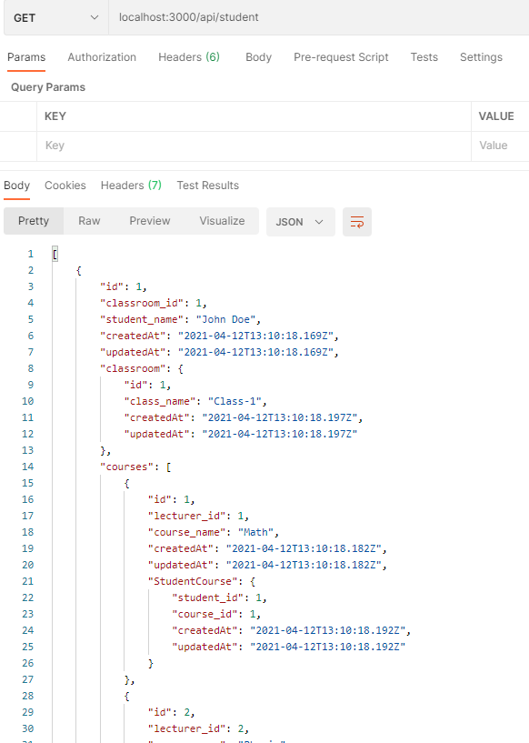
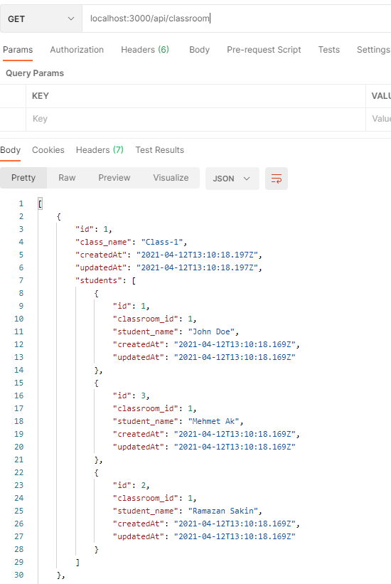
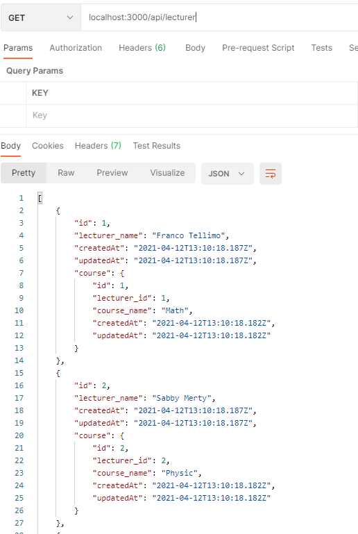
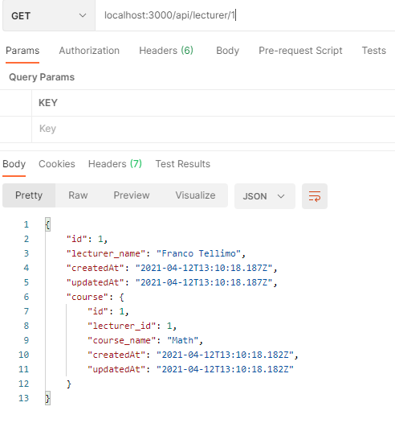
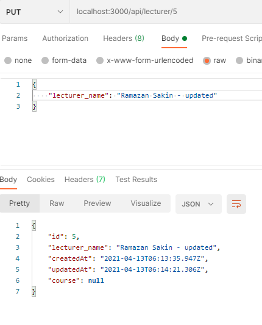
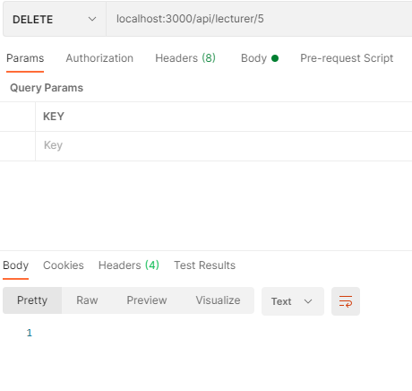

# Node.js, Express.js, Sequelize.js and PostgreSQL RESTful API

This source code is part of [Node.js, Express.js, Sequelize.js and PostgreSQL RESTful API](https://www.djamware.com/post/5b56a6cc80aca707dd4f65a9/nodejs-expressjs-sequelizejs-and-postgresql-restful-api) tutorial.

To run locally:

* Make sure you have install and run PostgreSQL server
* Create database with the name same as in config file
* Run `npm install` or `yarn install`
* Run `sequelize db:migrate`
* Run `sequelize db:seed:all` to feed databases via test datas(seeders)
* Run `sequelize db:seed:undo:all` to remove all test datas
* Run `nodemon` or `npm start`

## Postman test samples

### Get All Students

### Get All Classrooms

### Get All Lecturers

### Get Lecturer ById

### Create New Lecturer

### Update A Lecturer

### Delete A Lecturer

